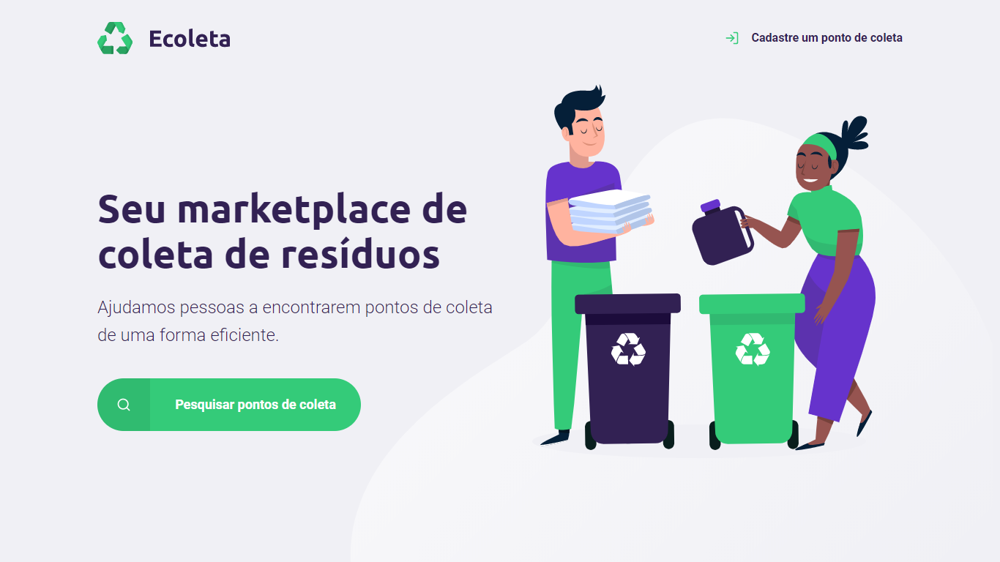

<h1 align="center">
    Next Level Week by 
    </h1>
  
  

  

_________
### Instrutor: [Mayk Brito](https://github.com/maykbrito)

### 🤔 Mas o que é isso? 
A NLW é uma experiência online criada pela Rocketseat de uma semana com muito conteúdo prático, desafios, hacks e um projeto que nos ajudam a avançar para o próximo nível e impulsionar a nossa carreira.
  
### ✨ Sobre o projeto:

O Ecoleta é um projeto criado para gerenciar o processo de coleta de lixo nas cidades. Com ele, é possível ajudar pessoas a encontrarem pontos de coleta de uma forma mais eficiente.
 
<h2 align="center"> 📷 Screenshot da home page do projeto: </h2>

_________
<h4 align="center"> <strong>By: Leonardo Oliveira™</strong> ❤ </h4>
